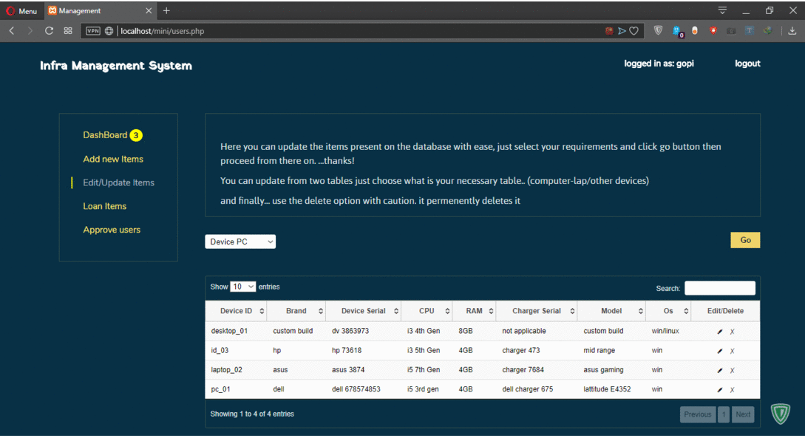

# PHP - infrastructure management system
> Adding, removing, updating, deleting, assigning device to users, register user, activate account...

## Getting Started & Why

Did this as a mini project for some reason.. this is my first (basic level) php project, i'm not a php expert, code is slopy here and there.

Tried different things with php because to have a learning curve and also why not, one of the reasons code and design being not consistent.

## Installation

Server with php running, use the dump.sql file first!!

Have a Demo live [Demo](http://bluepie.live/infra) 

its a simple passowrd you can guess it.. (or dm me on twitter for passowrd.. )

## Usage example

Place it on your server or local sever.  Set up the db, password, tables, run..

_All My the passwords used in this repo are local server.. so if you try to use my passowrd, 
it wont work on anything online... just a heads up._

## Built With

* Php
* Js
* Ton of custom css
* used skeleton css only for the start but it didn't suit the project later on
* PDO for database connectivity

## Authors

* **Gopinath (aka) BluePie** [Gopinath001](https://github.com/Gopinath001)

## Meta

Gopinath (aka) bluepie – [@bluepie](https://twitter.com/xbluepie) – gopinath2nr@gmail.com

